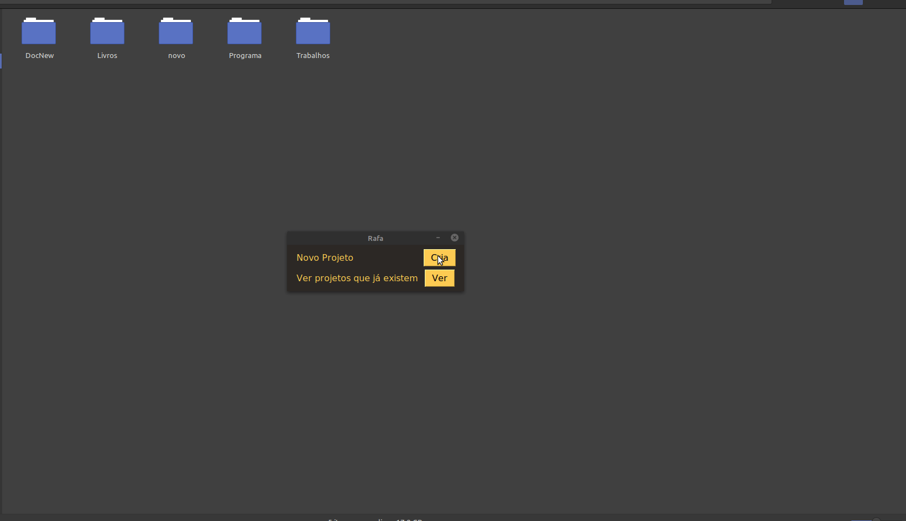
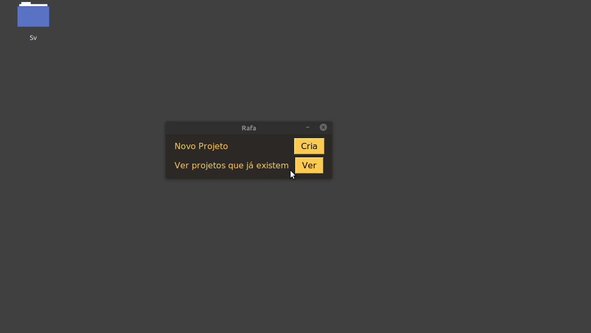
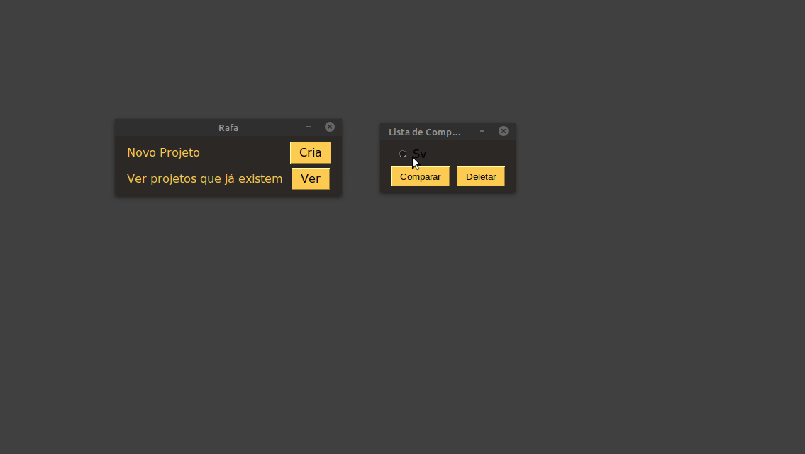
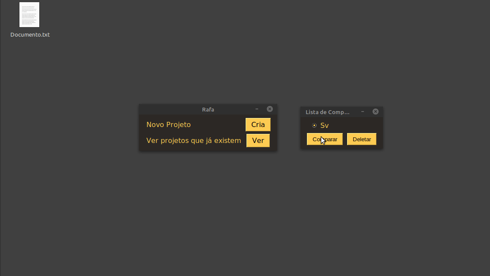

<h1>O que é?</h1>

Um programa desenvolvido em python com o objetivo de estudo e automatizar a o registro de modificação de projetos

<h1>Como usar</h1>
<h2>Primeira entrada</h2>

 ele vai te perguntar onde vocÊ quer salvar a versão do arquivo com qual você vai comparar depois de uma modificação

<h2>Criar projeto</h2>

Clique em criar, digite o nome do projeto e click em browse e selecione a pasta fonte do projeto

<h1>Deletar projetos</h1>

Depois de criar um projeto click em "Ver", selecione o projeto, click em "Deletar" e confirme clicando em "Yes"

<h1>Comparar projetos</h1>

Depois de criar um projeto click em "Ver", selecione o projeto, click em "Comparar" e confirme clicando em "Yes"

<h2>* Se não teve alteração desde o registro ou ultima comparação você terá uma mensagem dizendo que não há alteração</h2>

<h2>* Se teve alteração desde do ultimo registro ou ultima comparação, sera criado um arquivo "Logs.txt" onde sera registrado em qual dia, qual documento foi modificado</h2>

<h3>Ainda pretendo fazer melhorias de código e adicionar funcionalidades</h3>